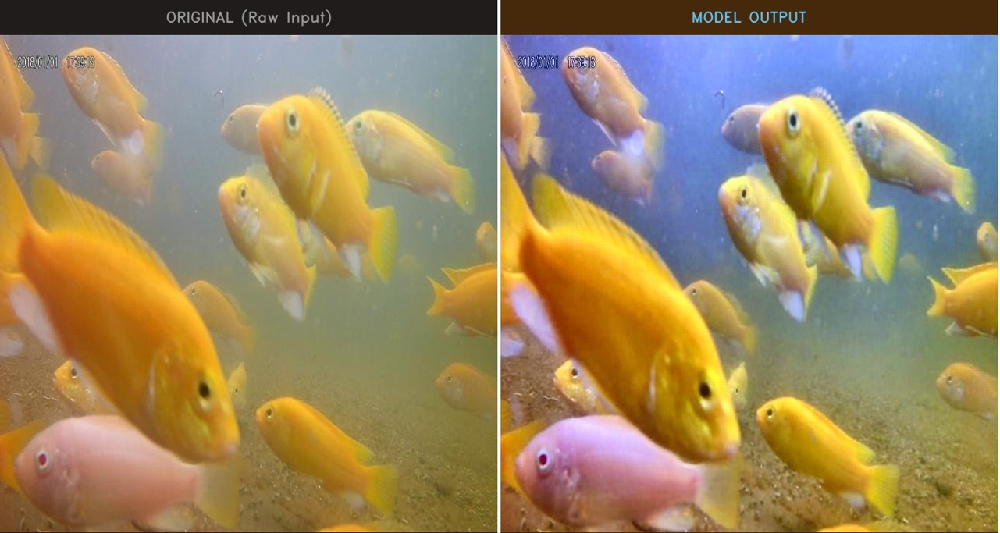
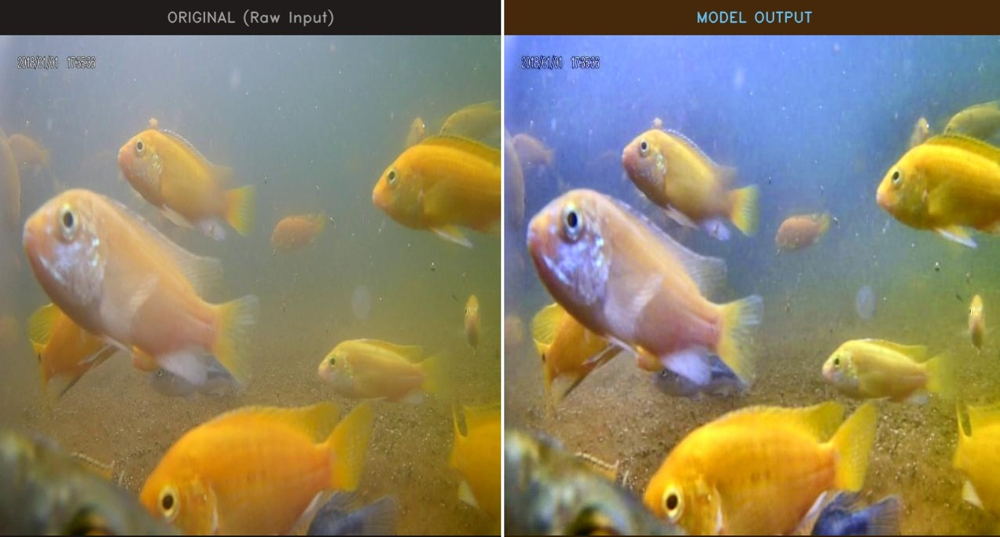
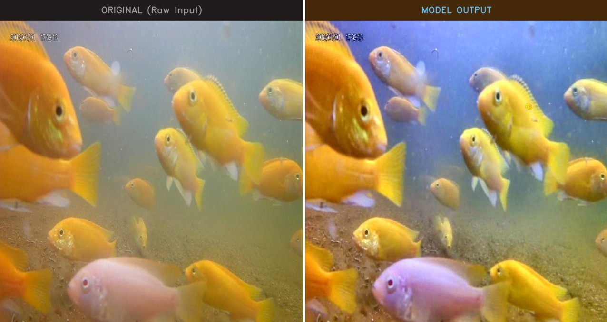
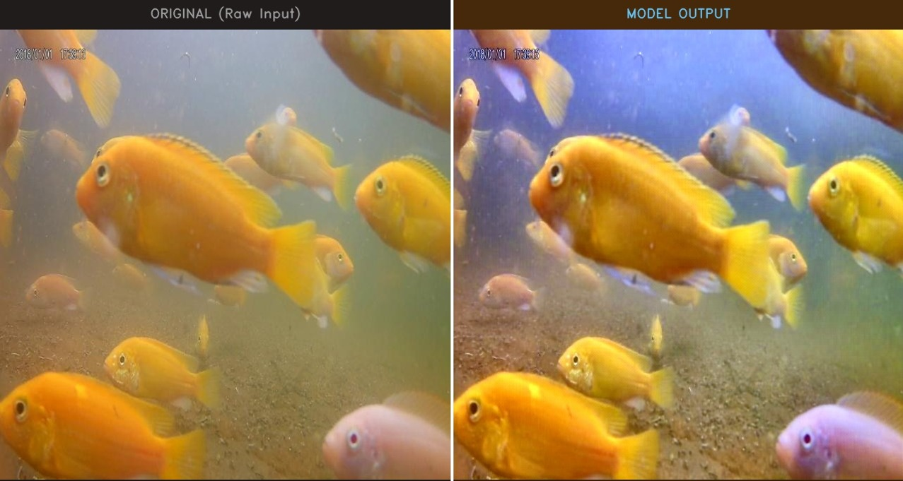
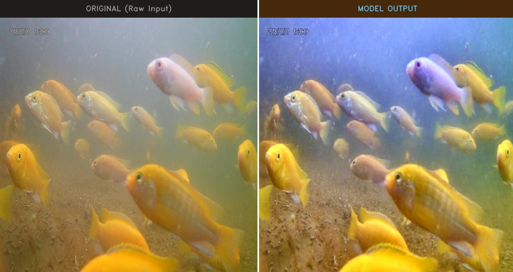
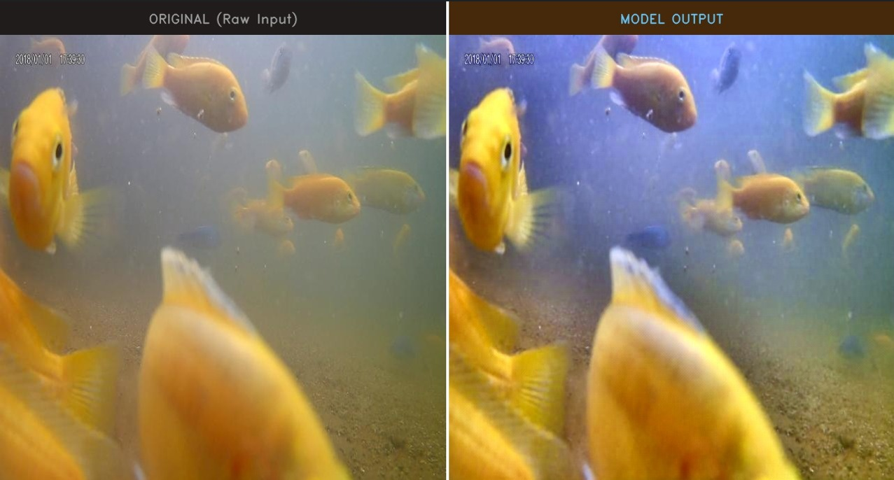

# Pond Water Image Enhancement

Deep learning and computer vision framework for enhancing degraded pond water imagery using GAN-based architectures and advanced image processing techniques.

---

## Overview

Pond water imagery often suffers from severe visual degradation caused by turbidity, low contrast, suspended particles, haze, and dominant green-yellow color casts. These distortions reduce underwater visibility and obscure fine visual details important for environmental monitoring and aquatic analysis.

This project presents a deep learning-based image enhancement framework designed specifically for degraded pond water images. The system combines classical computer vision enhancement techniques with a GAN-inspired Residual U-Net architecture to improve image clarity, color balance, contrast, and texture visibility while preserving natural image appearance.

The framework was developed using PyTorch and OpenCV and evaluated using quantitative image quality metrics including PSNR and SSIM.

---

## Features

- Residual U-Net based enhancement architecture
- CBAM attention modules for feature refinement
- GAN-inspired image enhancement framework
- Multi-stage preprocessing pipeline
- CLAHE-based adaptive contrast enhancement
- White balancing and color correction
- Vibrance and gamma enhancement
- Quantitative image quality evaluation
- Automated comparison generation
- Side-by-side enhancement visualization

---

## Technologies Used

- Python
- PyTorch
- OpenCV
- NumPy
- Matplotlib

---

## Repository Structure

```bash
pond-water-image-enhancement/
│
├── train.py
├── inference.py
├── model.py
├── dataset.py
├── metrics.py
├── full_metrics.py
├── measure_psnr.py
├── requirements.txt
├── README.md
│
├── results/
│   ├── result1.png
│   ├── result2.png
│   ├── result3.png
│   ├── result4.png
│   ├── result5.png
│   └── result6.png
│
├── sample_images.zip
│
└── PONDNET_RESEARCH_PAPER.pdf
```

---

## Installation

Clone the repository:

```bash
git clone https://github.com/Suhaiail/pond-water-image-enhancement.git
cd pond-water-image-enhancement
```

Install dependencies:

```bash
pip install -r requirements.txt
```

---

## Training

```bash
python train.py --data dataset/ --targets targets/
```

---

## Inference

```bash
python inference.py --input sample_images/ --output enhanced_output/
```

---

## Evaluation Metrics

The framework evaluates enhancement quality using:

- PSNR (Peak Signal-to-Noise Ratio)
- SSIM (Structural Similarity Index)
- L1 Loss
- NIQE
- BRISQUE

---

## Results

The proposed framework improves:

- underwater visibility
- image brightness
- local contrast
- edge sharpness
- texture clarity
- color vibrance

while maintaining visually natural outputs.


---


## Sample Results

### Enhancement Examples













---

## Dataset

Only sample images are included in this repository.

---

## Model Weights

Model checkpoint files are not included due to GitHub file size limitations.

---

## Research Paper

The repository includes the complete PondNet research paper describing:

- system architecture
- preprocessing methodology
- enhancement pipeline
- evaluation metrics
- experimental analysis
- quantitative results

---

## Applications

- Aquaculture monitoring
- Underwater image enhancement
- Environmental imaging
- Water quality visualization
- Computer vision research

---

## Author

Mohammed Suhail  
VIT Chennai
